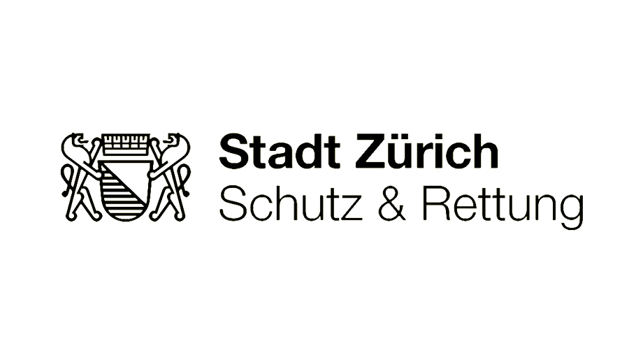

# Contribute

If you would like to contribute to this repository, please first report the change in an issue with the change you want to make.
Please note that we have a code of conduct. Please follow them in all interactions with the project.

## Pull request process

1. Place your pull request with a link to the issue that you have recorded.

2. Make sure that you have followed the guidelines in section CI / CD.

3. Your pull request will be accepted as soon as everything mentioned above is fulfilled.

4. THANK YOU!

## Behaviour rules

Examples of behaviors that help create a positive environment
lock in:

* Respect for different points of view and experiences
* Accept graceful constructive criticism
* Focus on what's best for the community
* Show empathy towards other community members, all experiences and skills are taken into account.

Examples of unacceptable behavior by participants are:

* The use of sexualized language or imagery and unwanted sexual attention or
Progress
* Trolling, offensive / derogatory comments, and personal or political attacks
* Public or private harassment
* Publication of the private information of others, e.g. B. physical or electronic
  Address, without express permission
* Other unprofessional or inappropriate behavior

# Corporate Identity SRZ

If you want to participate in this project, make sure to use the following CI / CD specifications in this repository. If you should use the software for yourself, all references to Schutz & Rettung must be removed. The attribution must be retained.

## HEX code

``` css
# CCFF33
```

## Logo

Please use the following logo (logo_srz.png)



# Ask

If you have any questions, just contact one of the SRZ contributors.