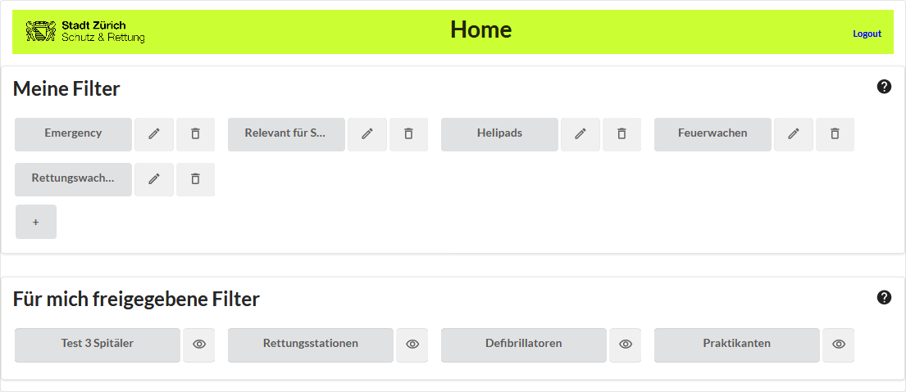

# Benutzer-Handbuch Targeted Monitoring Tool

# Einleitung

Das Targeted Monitoring Tool wurde im Auftrag von Schutz & Rettung Zürich (SRZ) entwickelt, welche für sicherheitsrelevante Zwecke [OpenStreetMap](https://www.openstreetmap.org/) verwendet. Trotz des Vertrauens in die OSM-Community, braucht es für heikle Kartenelemente eine Kontrolle, d.h. ein Monitoring der kritischen Datenobjekte. Da die Überwachung von Changesets über Objekt-Tags bei diversen bestehenden Monitoring-Tools nicht gegeben ist, kommt das Targeted Monitoring Tool zum Einsatz, welches Changesets nach Objekt-Tags filtert. So können ungewollte Änderungen erkannt und korrigiert werden.

* Installationsanleitung: [Hier](./InstallGuide.md)
* Frontend-Code: https://gitlab.dev.ifs.hsr.ch/se-na/sa-monitoring-osm-frontend
* Backend-Code: https://gitlab.dev.ifs.hsr.ch/DNA/sa-monitoring-osm-backend

## Anwendung

### Login

Beim erstmaligen Aufruf der Webseite erscheint die Login-Seite. Mit einem Klick auf den Login-Knopf werden Sie zu OpenStreetMap weitergeleitet. Dort können Sie sich mit Ihrem bestehenden OSM-Account anmelden, wenn Sie nicht bereits angemeldet sind. Es gibt nur die Möglichkeit, sich über OpenStreetMap anzumelden. Sollten Sie also noch keinen Account besitzen, müssen Sie diesen erst erstellen. Haben Sie sich mit Ihrem OSM-Account angemeldet, müssen Sie dem Targeted Monitoring Tool mit dem Klick auf "Zugriff gewähren" folgendes erlauben:
* Deine Benutzereinstellungen zu lesen
* Blogeinträge und Kommentare zu schreiben und Freunde einzutragen
* Hinweise zu geben/Fehler zu melden

### Home

Nach dem Login landen Sie automatisch auf der Home-Seite (Startseite). Diese Seite zeigt Ihnen ihre eigenen, sowie die Ihnen freigeschalteten Filter an. Sollten Sie noch keine Filter haben, ist die Liste leer. Im Bereich "Meine Filter" können Sie sich über den Button "+" einen neuen Filter anlegen. Wenn Sie bereits einen oder mehrere Filter angelegt haben, können Sie mit einem Klick auf den gewünschten Filter in die Ansicht wechseln, welche die zum aktuellen Filter passenden Changesets anzeigt. Zudem besteht die Möglichkeit, die eigenen Fiter zu bearbeiten oder zu löschen. Die freigegebenen Filter können Sie nicht bearbeiten oder löschen, aber dafür die Filter-Definition anschauen.

### Filter definieren

Einen neuen Filter können Sie über den Knopf "+" auf dem Home anlegen. Eigene Filter können Sie mit einem Klick auf das Stift-Symbol neben dem entsprechenden Filter bearbeiten und mit einem Klick auf das Mülltonnen-Symol löschen (Der Löschvorgang muss in einem seperaten Popup bestätigt werden).

Nach dem Klick auf das +-Symbol erscheint eine neue Seite, in der Sie den neuen Filter erfassen können. Die Filterdefinition ist in 3 Bereiche unterteilt:

#### Filterbezeichnung

Die Filter-Bezeichnung besteht aus einem Namen. Der Name muss eindeutig sein, Sie können also nicht schon einen Filter mit diesem Namen besitzen. Um einen Filter zu erstellen, muss dieses Feld zwingend ausgefüllt werden. Der Name des Filters dient im Home als Filter-Bezeichnung.

#### Filtermöglichkeiten

Die Filter-Möglichkeiten besteht aus zwei Bereichen. Sie können nach einem oder mehreren Tags in einem Kanton mit einem Buffer oder einem oder mehreren OSM-Benutzern suchen.

Für einen Filter nach Tags, müssen Sie die Felder Kanton und Tags ausfüllen und können zusätzlich einen Buffer angeben. Die Tags werden in der Form 'key=value' im entsprechenden Eingabefeld angegeben und mit der Enter-Taste bestätigt. Es können mehrere Tags angegeben werden. Bei mehreren Tags handelt es sich um eine Oder-Verknüpfung, die Suchergebnisse liefern also Changesets, die mindestens über einem Objekt mit einem der angegebenen Tags liegt.

Beispiel: amenity=hospital amenity=fire_station -> Changesets die ein Spital oder eine Feuerstation überlagern, werden angezeigt.

Da die Tags mit Hilfe von Overpass in eine Referenzfläche umgewandelt werden, müssen Sie die Region eingrenzen. Die Region können Sie im Dropdown mit der Überschrift "Kanton" auswählen. Der Buffer ermöglicht es Ihnen, auch Changesets zu erhalten, deren Ausdehnung in die Nähe der zu überwachenden Objekte fällt.

Beispiel: Spital wird beobachtet, aber Änderungen an der Zufahrt sollten auch bemerkt werden.

Für einen Filter nach Benutzer können Sie den OSM-Benutzernamen des zu überwachenden Nutzers im Feld mit der Überschrift "Benutzer" eingeben und mit der Enter-Taste bestätigen. Beim Filter werden dann kantonsunabhängig alle Changesets dieser Person angezeigt. Es können mehrere Personen gleichzeitig überwacht werden.

Werden Objekt-Tags, sowie OSM-Benutzer eingegeben, werden beim Filtern nur Changesets zurückgegeben, die zum Tag passen UND von einem der angegebenen Benutzern stammen.

### Filter-Freigabe

Im Bereich Filter-Freigabe können Sie Mitarbeiter hinzufügen. Geben Sie dazu den OSM-Namen des Mitarbeiters in das Feld mit der Überschrift "Mitarbeiter" ein und drücken die Enter-Taste. Die Changesets der hinzugefügten Mitarbeiter werden beim Filtern nicht angezeigt, ausser Sie werden zusätzlich bei den Filter-Möglichkeiten unter Benutzer eingetragen.

## Filter ansehen

Freigegebenen Filter können Sie zwar nicht bearbeiten, aber mit einem Klick auf das Augen-Symbol die Filter-Definition einsehen.

## Changesets überwachen

Mit dem Klick auf den Filter werden die Changesets gefiltert dargestellt. Die Filter zeigen passende Changesets seit dem Aufsetzen des Tools an. Changesets mit dem Status "abgeschlossen" werden nicht mehr angezeigt.

Mit einem Klick auf die einzelnen Datensätze, werden rechts im Fenster auf der Karte die passenden Änderungen eingezeichnet.

### Changesets abarbeiten

Wenn Sie mit dem Überprüfen eines Changesets beginnen, ist es zu empfehlen, zuerst die Statusmeldungen zu aktualisieren. Dazu müssen Sie auf den Button "Letzte Status Aktualisierung" klicken. Changesets mit dem Status "neu" sind noch zu überprüfen. Solche "in Bearbeitung" werden schon von einem ihrer Mitarbeiter überprüft. Bevor Sie also ein Changeset überprüfen, sollten Sie zuerst den Status "in Bearbeitung" auswählen, damit ihre Mitarbeiter darüber Bescheid wissen.

Um die Zeit effizient zu nutzen, können Sie die Changesets auch nach Gewichtung abarbeiten. Dabei werden Changesets die Löschungen beinhalten als "Hoch" klassiert und solche mit Bearbeitungen als "Mittel". Wurden neue Objekte hinzufügt, zeigt die Gewichtung "Gering".

Wenn Sie sich mit einem Changeset befassen und den Status auf "in Bearbeitung" gesetzt haben, können Sie bei einem Klick auf die Changeset-Nummer (blau) in einem neuen Fenster in OpenStreetMap das Objekt bearbeiten. Wenn es nichts anzupassen gibt, oder die Anpassungen vollendet sind, können Sie dem Changeset den Status "abgeschlossen" geben. Solange Sie sich in der Ansicht befinden, bleiben auch die abgeschlossen Changesets sichtbar. Haben Sie also versehentlich ein Changeset auf "abgeschlossen" gesetzt, können Sie das noch ändern. Beim Neuladen, werden die Abgeschlossenen aber nicht mehr dargestellt.

