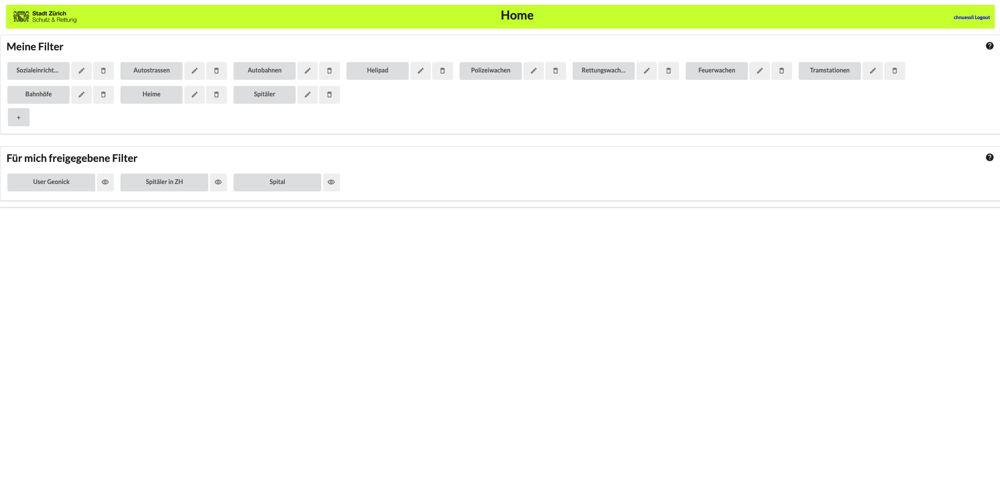
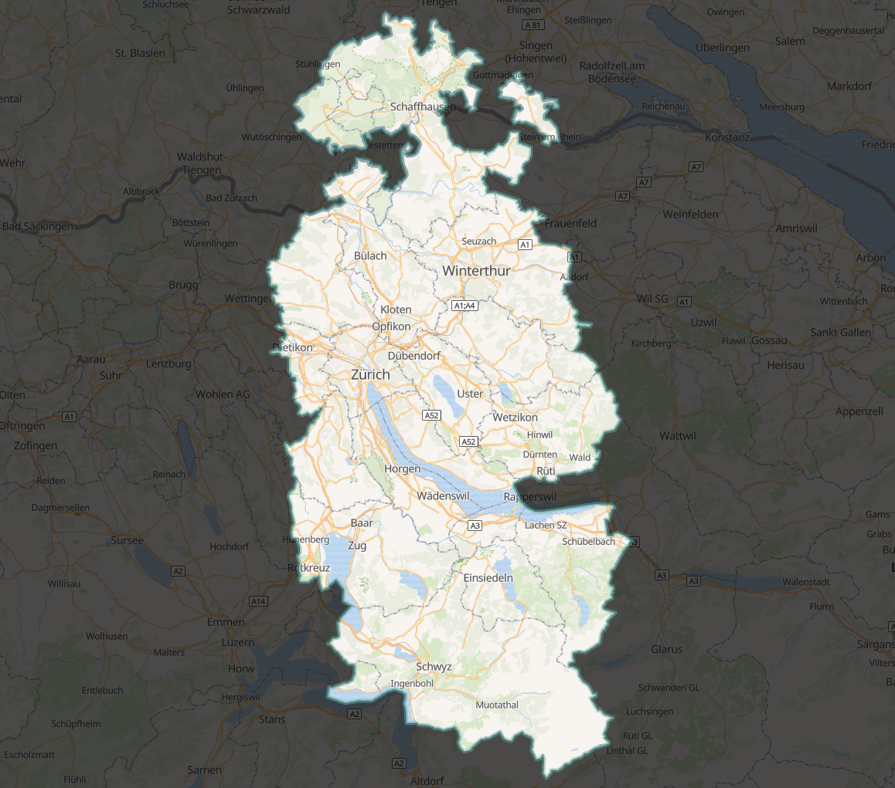

# Schutz & Rettung Zürich - Emergency Data Inspector

This Page is also available in English, please visit: [English 👈🏻](README_en.md)

## Zweck

Mit dem [Emergency Data Inspector (SRZ-EDI)](https://srzedi.srz.borsnet.ch/) erarbeiten wir zusammen mit der [OST](https://www.ost.ch) ein Tool um unseren Datenmanagern auf einfachste Weise zu ermöglichen, die Daten in unserem [Dispogebiet](#dispogebiet-srz). 

## Erklärung zum Tool

Hierhin kommen dann die Erklärungen zum Tool

### Frontend

Beschreibung zum Frontend

### CI-CD

Alles was unter dem Namen SRZ publiziert wird, soll sich ans [CI/CD](ci_cd.md) halten. Pull-requests für SRZEDI werden nur damit angenommen.

### Backend

Beschreibung zum Backend

## Dispogebiet SRZ

Zum Dispogebiet von SRZ gehören folgende Kantone inkl. Notrufnummer der Zuständigkeit:

* Zürich (144/118) -> CH-ZH
* Schwyz (144) -> CH-SZ
* Zug (144) -> CH-ZG
* Schaffhausen (144) -> CH-ZG

## Unsere Datenpflege in OpenStreetMap

Grundsätzlich finden sich alle Informationen über unser organisiertes Mapping unter: [Schutz und Rettung organisiertes Mapping](https://wiki.openstreetmap.org/wiki/Organised_Editing/Activities/SchutzRettung_Rescue)

### Objekte

*siehe auch [critical_nodes.md](critical_nodes.md)*

Einige Objekte kurz als Liste welche in unsere Tätigkeit besonders wichtig sind und überwacht werden sollten. Detaillierte Beschreibungen der Objekte findet ihr in der oben erwähnten Datei.

## Mitmachen

Hast du einen [Fehler](https://github.com/Schutz-Rettung-Zurich/srzedi/issues) entdeckt oder möchtest eine [neue Funktion](https://github.com/Schutz-Rettung-Zurich/srzedi/issues) vorschlagen platziere bitte ein Issue in unserem Github Repository.
Solltest du dich direkt beteiligen wollen beachte bitte [Contributing Guidelines](CONTRIBUTING.md). Pull Requests sind aber sehr willkommen.

## Lizenz

Die Software läuft unter der [MIT Lizenz](LICENSE).
